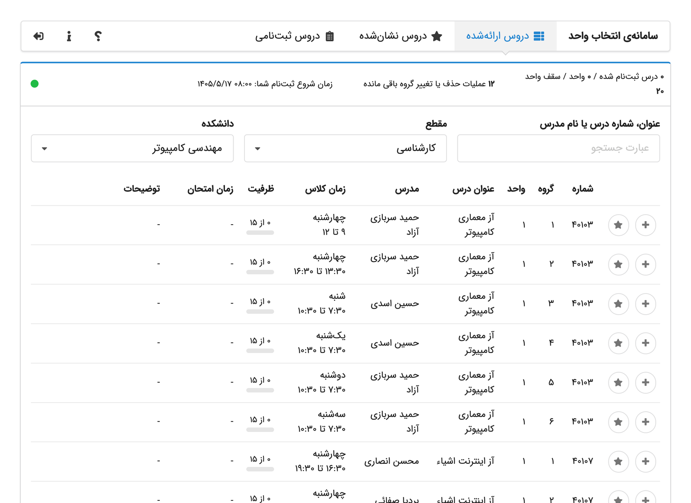
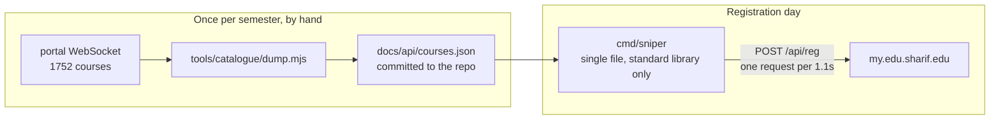
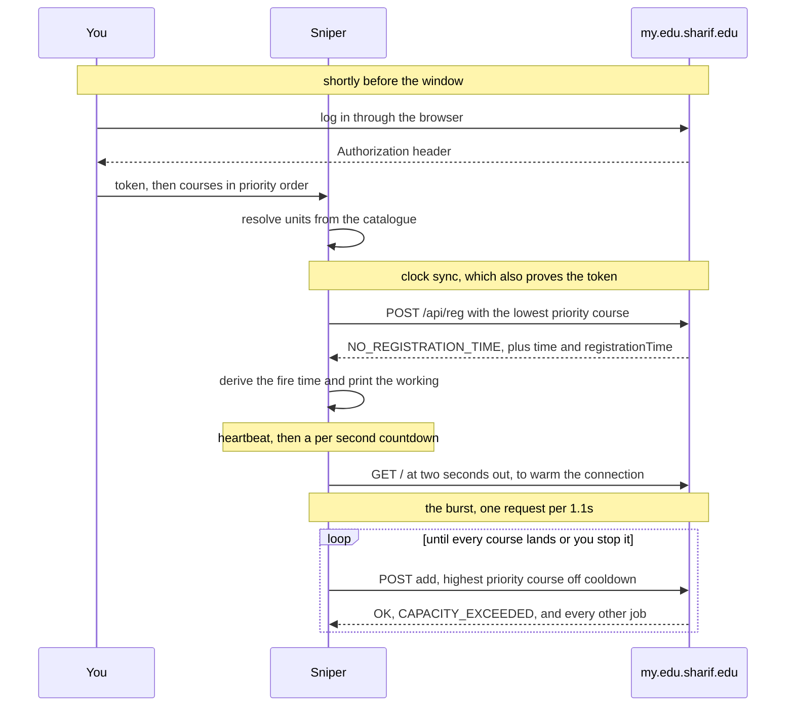
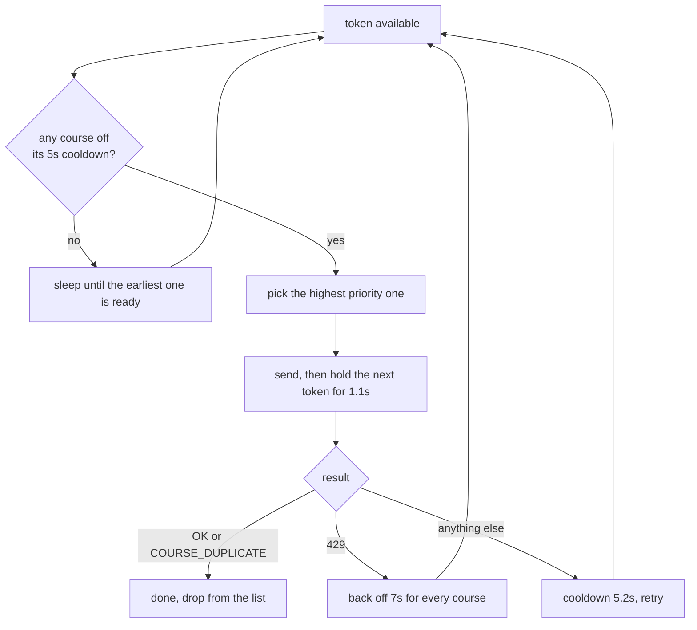

# my.edu.sharif.edu-sniper

Registers courses on the Sharif University student portal the moment your
registration window opens. It syncs to the server's clock, sleeps until the
window, then works through your course list until everything lands.

Almost every design choice here is a reaction to a measured behaviour of the
registration API rather than a matter of taste. This document covers the tool:
how to run it, and why it is built the way it is. The behaviours it is reacting
to are written up separately in [docs/reference](docs/reference/), starting
with [the server contract](docs/reference/server-contract.md).

---

## Quick start

You do not need Go, or anything else, installed. Every release ships a single
self contained binary per platform on the
[releases page](https://github.com/erfnzdeh/my.edu.sharif.edu-sniper/releases/latest).
Download the one for your machine, then run it from a terminal.

**macOS** (`sniper_darwin_arm64` for Apple silicon, `sniper_darwin_amd64` for
an Intel Mac). The binary is unsigned, so Gatekeeper needs to be told once:

```
chmod +x sniper_darwin_arm64
xattr -c sniper_darwin_arm64
./sniper_darwin_arm64
```

**Linux** (`sniper_linux_amd64`, or `sniper_linux_arm64`):

```
chmod +x sniper_linux_amd64
./sniper_linux_amd64
```

**Windows** (`sniper_windows_amd64.exe`). Open PowerShell in the download
folder and run it. SmartScreen may warn about an unknown publisher the first
time, under "More info" and then "Run anyway":

```
.\sniper_windows_amd64.exe
```

It will then ask for your token and your courses. To skip the prompts:

```
./sniper -token "$MYEDU_TOKEN" -courses 40404-1,22034-2,30004-1 -at 16:00 -y
```

Log in at [my.edu.sharif.edu](https://my.edu.sharif.edu) shortly before your
window, open the browser network tab, and copy the `Authorization` request
header from any API call. Sessions last roughly an hour.

Every run prints its version in the banner and the transcript, and
`sniper -version` reports it on its own. Quote it in any bug report.

The binary carries no data files. It reads the course catalogue from
`docs/api/courses.json` next to it if you cloned the repository, and otherwise
fetches the published copy over HTTPS, so a lone binary is fully functional.

### Building it yourself

If you do have Go, the build is the ordinary one and needs no dependencies:

```
go build -o sniper ./cmd/sniper
./sniper
```

Or straight from the module, no clone needed:

```
go install github.com/erfnzdeh/my.edu.sharif.edu-sniper/cmd/sniper@latest
```

---

## Architecture

Two pieces, deliberately separated so the time critical one stays trivial.



The portal only publishes its course list over a WebSocket, and the sniper
needs each course's unit count. Rather than put a WebSocket client in the path
that runs under time pressure, the catalogue is dumped by hand once a semester
and read back as plain JSON.

---

## Lifecycle



---

## Decision 1: pace at one request per second

This is the whole game. The edge allows one request per second, applied per
client, and rejects the excess with a real `429` rather than queueing it. A
parallel burst therefore throws most of its requests away. Full measurements in
[docs/reference/rate-limits.md](docs/reference/rate-limits.md).

So the scheduler holds a single global token, released every 1.1 seconds, and
spends it on the highest priority course that is off its own cooldown:



Two independent constraints are in play. The per course rule is five seconds
between attempts at the same course, and the global rule is one request per
second overall. With five or more courses the global rule already satisfies
the per course one, and below that the per course cooldown binds.

## Decision 2: list order is priority order

Because requests are paced, the Nth course on your list makes its first
attempt roughly N seconds after the window opens. With ten courses, the last
one waits nine seconds. Put the courses that fill in seconds at the top.

## Decision 3: sleep precisely, and land slightly late on purpose

The client computes one sleep from the server's own clock rather than polling
toward the window. Given a probe sent at `t0`, answered at `t1`, with the
server reporting `S` and the window at `R`:

```
fire = t1 + (R - S) + roundTrip + 100ms
```

The margin is biased late deliberately. Arriving early is rejected **and**
burns that course's five second cooldown, so a request 100ms early costs about
five seconds. A request 100ms late costs 100ms. The client prints this
derivation with your actual numbers before it commits to a fire time.

## Decision 4: units come from the catalogue

The portal range checks units between `0` and the course's own value, and
courses flagged `isVariable` accept anything in that range. A mismatch fails
with `INCORRECT_UNIT_NUMBER`, so hardcoding a value is not safe. On one real
ten course list, five courses were not three units and one was zero, so a
hardcoded `3` would have failed half the list.

The catalogue also means a wrong course code is caught while you are typing it
rather than at the window.

---

## The catalogue

`docs/api/courses.json` maps `CODE-GROUP` to the fields the sniper needs:

```json
{ "40404-1": { "u": 1, "v": 0, "t": "آز مهندسی نرم‌افزار", "c": 30 } }
```

`u` is units, `v` marks a variable unit course, `t` is the title, and `c` is
capacity at dump time, which goes stale quickly.

Regenerate it once per semester, after the offered list is final:

```
MYEDU_TOKEN='<Authorization header>' node tools/catalogue/dump.mjs
```

It needs Node 22 or newer for the global `WebSocket` and has no dependencies.
It reads only the catalogue frame, copies four whitelisted fields per course,
and refuses to write anything if your token or a student identifier shows up
in the output.

The sniper looks for the catalogue in this order:

1. whatever `-catalogue` points at, a path or a URL
2. `docs/api/courses.json` next to the source or the binary
3. the published URL in `catalogueURL`

The local copy means it works with no network at all. The published copy is
live at
[erfnzdeh.github.io/my.edu.sharif.edu-sniper](https://erfnzdeh.github.io/my.edu.sharif.edu-sniper/),
served from `main` under `/docs`, so a clone is not required to read it:

```
curl https://erfnzdeh.github.io/my.edu.sharif.edu-sniper/api/courses.json
```

---

## Flags

| Flag | Meaning |
| --- | --- |
| `-token` | Authorization header value. Also read from `MYEDU_TOKEN`. |
| `-courses` | Comma separated, in priority order, for example `40404-1,22034-2:1`. |
| `-at` | Window time as `HH:MM`. Required with `-y` when `registrationTime` is stale. |
| `-y` | Skip the confirmation prompt. Needs `-token` and `-courses`. |
| `-catalogue` | Path or URL of `courses.json`. |
| `-transcript` | Transcript path. Defaults to `snipe-<timestamp>.log`. |
| `-version` | Print the version, platform and Go version, then exit. |

Exit codes: `0` when everything landed, `1` when something is still
outstanding, `2` for a setup or authentication failure.

Transcripts record every request and response verbatim, **including your
token**, so they are gitignored. Delete them when you are done.

---

## Reference

The portal's API is undocumented by the university, so it was reverse
engineered from the live endpoint and the frontend bundle. Those notes live in
[docs/reference](docs/reference/) rather than here:

| Document | Covers |
| --- | --- |
| [server-contract.md](docs/reference/server-contract.md) | every measured behaviour and what it forces the client to do |
| [http-api.md](docs/reference/http-api.md) | the five endpoints and their request and response shapes |
| [websocket.md](docs/reference/websocket.md) | the only source of course data, and the `userState` and course schemas |
| [rate-limits.md](docs/reference/rate-limits.md) | all three limiters, measured |
| [auth.md](docs/reference/auth.md) | token shape, lifetime, and why the WebSocket ignores it |
| [error-codes.md](docs/reference/error-codes.md) | triage, plus every code with its Persian text and meaning |

---

## TODO

- **Reconsider `globalGap`.** Re-measured on a warm pooled connection, 1.10s
  passed 12 of 14 requests while 1.30s passed 14 of 14. The limit is still one
  per second; the losses are round trip jitter, which ranged from 46ms to
  2037ms within a single run. Since a `429` currently backs every course off by
  7 seconds, paying 200ms more per request to avoid a roughly one in seven
  chance of that stall looks like a clear win. Worth re-running from the campus
  network before changing the constant, since the jitter is what drives it.
  Numbers in [docs/reference/rate-limits.md](docs/reference/rate-limits.md).
- **Median of N clock probes.** The offset comes from a single probe today, so
  one unlucky packet skews the fire time. Before the window, extra probes are
  nearly free because their cooldowns expire long before firing. Taking the
  median of three or five, and printing the spread, would make the measurement
  honest and show how jittery the link is.
- **Support `remove` and `move` for add and drop.** The API takes three
  actions, not one. Adding `remove`, and `move` for changing group, would make
  the tool useful during add and drop rather than only at registration.
  Removals are irreversible, so they need a confirmation the adds do not.
