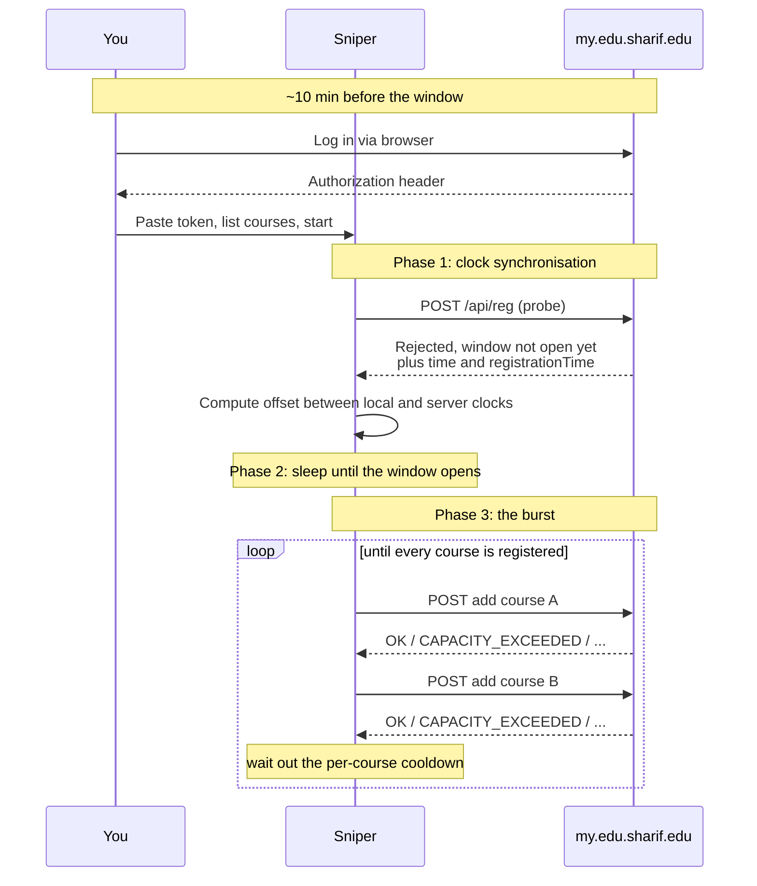
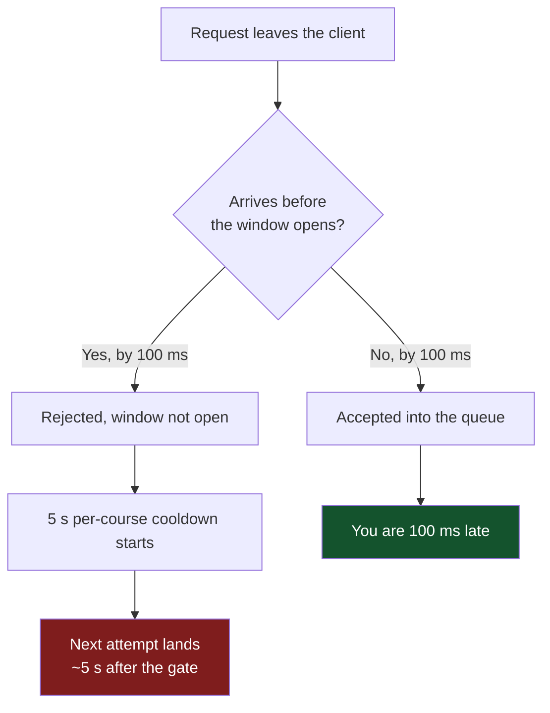
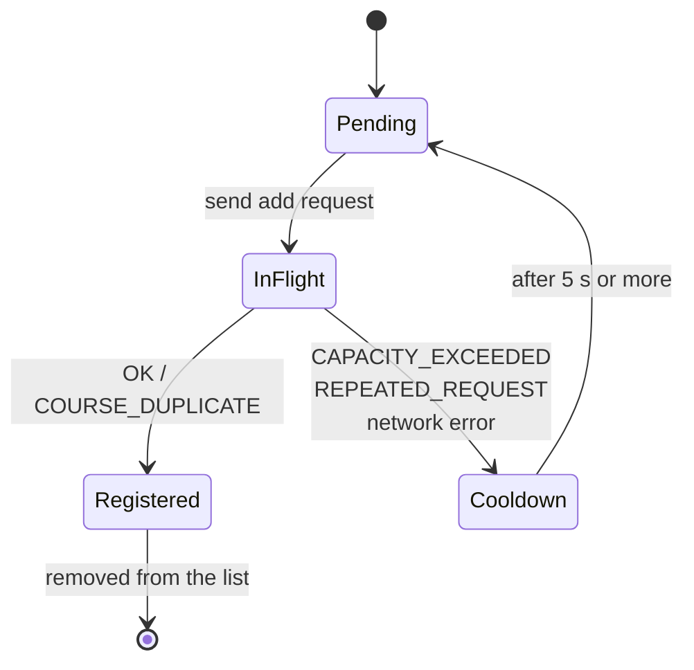

# my.edu.sharif.edu-sniper

Automates course registration on the Sharif University student portal
(`my.edu.sharif.edu`). It sleeps until your registration window opens, fires an
`add` request for each course on your list, and keeps retrying the ones that
did not land.

The program is deliberately small: one file, standard library only. Almost
every design choice in it is a reaction to a specific behaviour of the
registration API rather than a matter of taste, so this document records those
behaviours and the decisions that follow from them.

---

## The server contract

These are empirical observations of the registration endpoint
(`POST /api/reg`). They are not documented by the university; they were
established by watching the API during live registration periods.

| Observed behaviour | Consequence for the client |
| --- | --- |
| A request sent **before** your personal registration time is rejected with an error. | Firing early is not free. You must wait, not poll. |
| The rejection response **still carries the server's timestamps**. | A pre-window request doubles as a clock-synchronisation probe. |
| Two requests for the **same course** must be at least **5 seconds** apart, or you get `REPEATED_REQUEST`. | The cooldown is *per course*, not per account. |
| The response body contains `time`, the server's current Unix time in milliseconds. | The client can measure the offset between its own clock and the server's. |
| The response body contains `registrationTime`, your window's opening time, also Unix ms. | The target time comes from the server; it does not need to be configured. |
| Under load the server returns an HTML block page instead of JSON. | The client must sniff for a non-JSON body before attempting to decode. |
| Login opens roughly **10 minutes** before the registration window, and sessions have been observed expiring within minutes. | The auth token is short-lived and must be captured shortly before the run. |
| Parallel in-flight requests are served more slowly than serialised ones. | Concurrency is capped; requests are sent one at a time. |

Because both `time` and `registrationTime` are Unix timestamps, the comparison
between them is timezone-independent. No timezone configuration is needed on
the main path.

---

## Lifecycle



---

## Decision 1: sleep precisely, and land slightly late on purpose

The client does not poll toward the opening time. It computes a single sleep
duration from the server's own clock and wakes up once.

Given a probe sent at local time `t0`, answered at `t1`, with the server
reporting its own time as `S` and the window opening at `R`:

```
RTT    = t1 - t0
delay  = (R - S) - RTT      # arrives at the server exactly at R
```

The client does **not** aim for exact arrival. It adds a positive safety
margin, because the cost of the two failure directions is wildly asymmetric:



Arriving 100 ms early costs about **five seconds**. Arriving 100 ms late costs
**100 milliseconds**. So the margin is always biased positive; never try to
shave it to zero.

The margin's job is to absorb three sources of error: asymmetric network
latency, drift between the local and server clocks during the sleep, and the
imprecision of a long `time.Sleep`. The longer the sleep, the larger the margin
has to be, which is the argument for re-probing the clock shortly before the
window and recomputing from a fresh measurement so the margin can stay small.

---

## Decision 2: the 5-second cooldown is per course

This is what makes the burst worthwhile. Because the cooldown is scoped to a
course rather than to the account, **every course on your list can be attempted
immediately** when the window opens. There is no need to stagger them.

A single course moves through this cycle:



A course is dropped from the working list on `OK` (registered) or
`COURSE_DUPLICATE` (already registered, so nothing left to do). Every other
outcome sends it back around. The program exits when the list is empty.

---

## Decision 3: requests are serialised, and list order is priority

Sending all courses in parallel makes the server slower to answer, so requests
go out one at a time. That has a consequence worth knowing:

> **The Nth course on your list makes its first attempt after roughly N round
> trips.** With ten courses on a 300 ms link, the last one's first shot lands
> about three seconds after the gate opens.

Put the contested courses (the ones that fill in seconds) at the **top** of the
list. Courses that will still have capacity in a minute can go anywhere.

---

## Decision 4: the token is captured by hand, late

There is no automated login. You log in through a browser once the login window
opens, copy the `Authorization` header out of the request, and hand it to the
program.

This is not laziness: sessions are short-lived and have been observed expiring
within minutes, so a token captured hours earlier is worthless. Capturing it a
few minutes before the run is the only reliable approach.

The practical implication is that **you must be able to replace the token
quickly**, under time pressure, in a window only a few minutes wide.

---

## Decision 5: the script is an assistant, not a replacement

Keep the portal open in a browser while the script runs, and be ready to
register manually. The script can lose the race, hit a block page, or run on a
dead token. Its output is meant to be watched, not walked away from, so it
should always be obvious, at a glance, which courses are still outstanding.

---

## Setup

1. Add your courses to `vaheds` in `main.go`, in priority order. The `course`
   field is `[CODE]-[GROUP]`, e.g. `22034-2`.
2. Log in to the portal when the login window opens, and copy the
   `Authorization` request header from your browser's network tab into
   `AuthToken`.
3. Build and run:

   ```
   go build -o sniper . && ./sniper
   ```

Start the program before your registration window opens. It needs at least one
probe round trip, plus a few seconds of clearance, to synchronise its clock
without spending a cooldown on your top-priority course.

---

## Error codes

Returned in the `result` field of a job, or embedded in the response body:

| Code | Meaning |
| --- | --- |
| `OK` | Registered. |
| `COURSE_DUPLICATE` | Already registered for this course. |
| `CAPACITY_EXCEEDED` | Course is full, but worth retrying since people drop. |
| `REPEATED_REQUEST` | The 5-second per-course cooldown was violated. |
| `COURSE_NOT_FOUND` | Bad course code or group number. |
| `MAAREF_COURSES_LIMIT` | Hit the cap on Maaref course units. |
| *HTML body* | Rate-limited or blocked at the edge; back off. |
