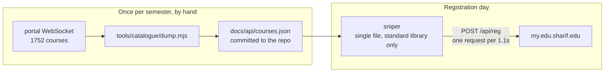
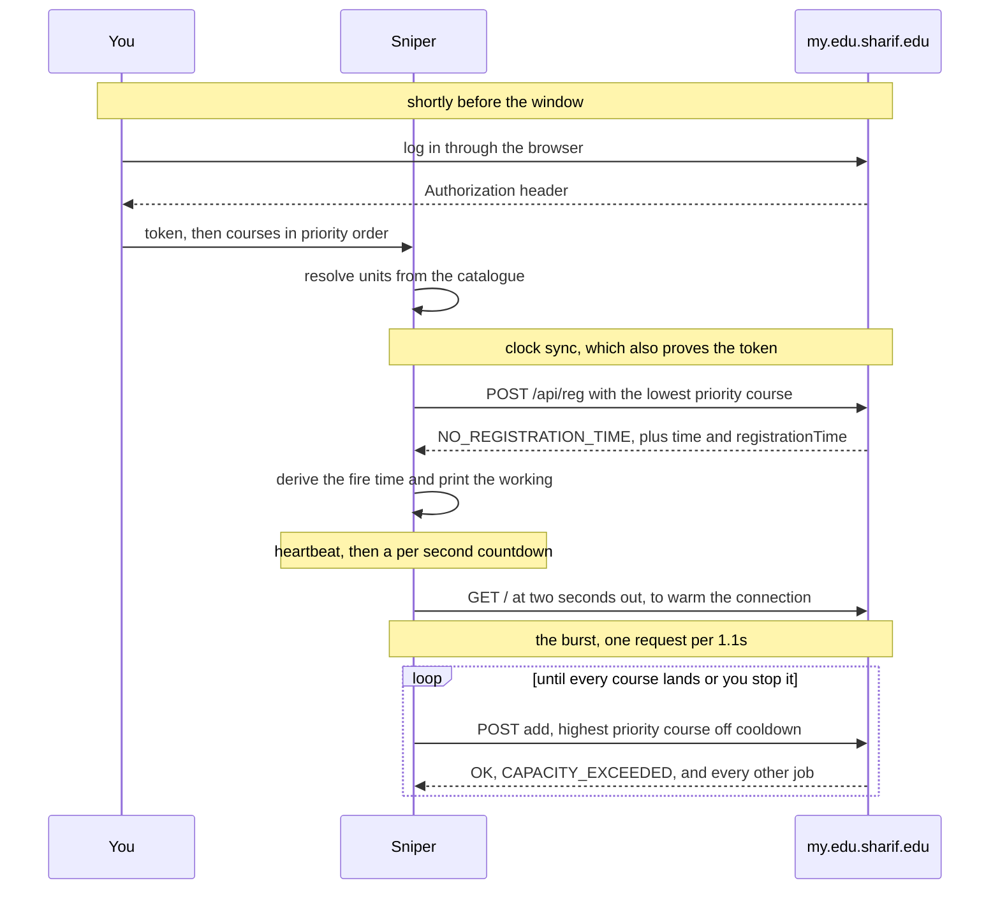
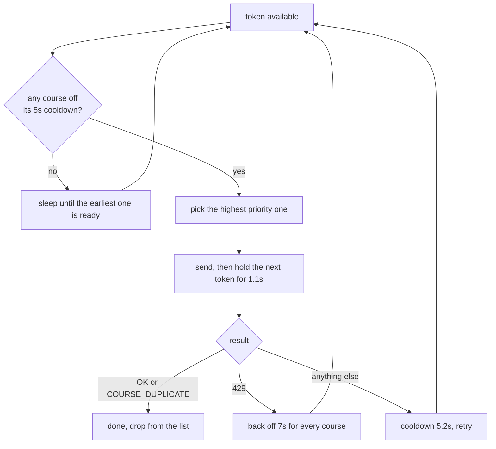

# my.edu.sharif.edu-sniper

Registers courses on the Sharif University student portal the moment your
registration window opens. It syncs to the server's clock, sleeps until the
window, then works through your course list until everything lands.

Almost every design choice here is a reaction to a measured behaviour of the
registration API rather than a matter of taste, so this document records the
measurements first and the decisions that follow from them.

---

## Quick start

```
go build -o sniper .
./sniper
```

It will ask for your token and your courses. To skip the prompts:

```
./sniper -token "$EDU_TOKEN" -courses 40404-1,22034-2,30004-1 -at 16:00 -y
```

Log in at [my.edu.sharif.edu](https://my.edu.sharif.edu) shortly before your
window, open the browser network tab, and copy the `Authorization` request
header from any API call. Sessions last roughly an hour.

---

## The server contract

Established by measuring the live endpoint and reading the portal's own
frontend bundle. None of it is documented by the university.

| Measured behaviour | Consequence for the client |
| --- | --- |
| The edge allows **exactly one request per second, with no burst**, and rejects the rest with a real HTTP `429` and an HTML body. | A parallel burst throws most of its requests away. Pacing is the single most important thing the client does. |
| **Every** request to the host counts, including a plain `GET /`. | Connection warm up must happen well before the window, never immediately before it. |
| Application errors arrive as **HTTP 200** with an `error` field in the JSON body. | Status codes cannot be used to detect failure, apart from `429`. |
| Auth failure is `{"error":"AUTHORIZATION"}`, never a `401`. | The token check has to read the body. |
| Tokens carry **no `exp` claim** and expire server side after roughly an hour. | Expiry cannot be predicted, only observed. Capture the token shortly before you need it. |
| A request before your window is rejected with `NO_REGISTRATION_TIME`, and that takes precedence over course validation. | Course codes cannot be checked against `/api/reg` ahead of time. |
| The response carries `time` and `registrationTime` as Unix milliseconds. | The client can measure its clock offset without trusting its own. |
| `registrationTime` **goes stale** and can point at a window weeks past. | The target time often has to come from you. There are two daily windows, 08:00 and 16:00. |
| `jobs` is ordered **newest first** and accumulates for the whole session. | Reading it backwards returns the oldest result for a course and misses a later success. |
| A job with **no `result`** is still queued server side. | Absence of a result is not failure. |
| The response describes **every** job, not just the one you asked about. | One request can reveal that a different course already landed. |
| `units` is **range checked** against the course, and a mismatch fails with `INCORRECT_UNIT_NUMBER`. | Units cannot be guessed. See the catalogue below. |
| `remainingActions` is a real quota, with its own `NO_REMAINED_ACTION` code. | Worth watching during add and drop. |
| The course catalogue is served **only over a WebSocket**, never REST. | Hence the separate catalogue tool. |
| A cold TLS handshake costs about 650ms against 170ms on a pooled connection. | Worth warming, at the right moment. |

Both `time` and `registrationTime` are Unix timestamps, so comparing them is
timezone independent. The portal is only reachable from inside Iran, so local
time and server time agree.

---

## Architecture

Two pieces, deliberately separated so the time critical one stays trivial.



The portal only publishes its course list over a WebSocket, and the sniper
needs each course's unit count. Rather than put a WebSocket client in the path
that runs under time pressure, the catalogue is dumped by hand once a semester
and read back as plain JSON.

---

## Lifecycle



---

## Decision 1: pace at one request per second

This is the whole game. Measured at 0.5s spacing, responses alternate
perfectly between `200` and `429`. At 0.34s spacing, the successes still land
about 1.25 seconds apart. The limit is one request per second, applied per
client, and excess requests are rejected rather than queued.

So the scheduler holds a single global token, released every 1.1 seconds, and
spends it on the highest priority course that is off its own cooldown:



Two independent constraints are in play. The per course rule is five seconds
between attempts at the same course, and the global rule is one request per
second overall. With five or more courses the global rule already satisfies
the per course one, and below that the per course cooldown binds.

## Decision 2: list order is priority order

Because requests are paced, the Nth course on your list makes its first
attempt roughly N seconds after the window opens. With ten courses, the last
one waits nine seconds. Put the courses that fill in seconds at the top.

## Decision 3: sleep precisely, and land slightly late on purpose

The client computes one sleep from the server's own clock rather than polling
toward the window. Given a probe sent at `t0`, answered at `t1`, with the
server reporting `S` and the window at `R`:

```
fire = t1 + (R - S) + roundTrip + 100ms
```

The margin is biased late deliberately. Arriving early is rejected **and**
burns that course's five second cooldown, so a request 100ms early costs about
five seconds. A request 100ms late costs 100ms. The client prints this
derivation with your actual numbers before it commits to a fire time.

## Decision 4: units come from the catalogue

The portal range checks units between `0` and the course's own value, and
courses flagged `isVariable` accept anything in that range. Hardcoding a value
is not safe. On one real ten course list, five courses were not three units
and one was zero, so a hardcoded `3` would have failed half the list with
`INCORRECT_UNIT_NUMBER`.

The catalogue also means a wrong course code is caught while you are typing it
rather than at the window.

## Decision 5: the script is an assistant, not a replacement

Keep the portal open in a browser and be ready to register by hand. The script
can lose a race, hit a block page, or run on a dead token. Every attempt is
logged with a timestamp, an attempt counter and the exact retry time, and a
terminal bell rings each time a course lands.

---

## The catalogue

`docs/api/courses.json` maps `CODE-GROUP` to the fields the sniper needs:

```json
{ "40404-1": { "u": 1, "v": 0, "t": "آز مهندسی نرم‌افزار", "c": 30 } }
```

`u` is units, `v` marks a variable unit course, `t` is the title, and `c` is
capacity at dump time, which goes stale quickly.

Regenerate it once per semester, after the offered list is final:

```
EDU_TOKEN='<Authorization header>' node tools/catalogue/dump.mjs
```

It needs Node 22 or newer for the global `WebSocket` and has no dependencies.
It reads only the catalogue frame, copies four whitelisted fields per course,
and refuses to write anything if your token or a student identifier shows up
in the output.

The sniper looks for the catalogue in this order:

1. whatever `-catalogue` points at, a path or a URL
2. `docs/api/courses.json` next to the source or the binary
3. the published URL in `catalogueURL`

The local copy means it works with no network at all. Serving it over HTTP
from GitHub Pages needs the repository to be public, or a plan that supports
Pages on private repositories.

---

## Flags

| Flag | Meaning |
| --- | --- |
| `-token` | Authorization header value. Also read from `EDU_TOKEN`. |
| `-courses` | Comma separated, in priority order, for example `40404-1,22034-2:1`. |
| `-at` | Window time as `HH:MM`. Required with `-y` when `registrationTime` is stale. |
| `-y` | Skip the confirmation prompt. Needs `-token` and `-courses`. |
| `-catalogue` | Path or URL of `courses.json`. |
| `-transcript` | Transcript path. Defaults to `snipe-<timestamp>.log`. |

Exit codes: `0` when everything landed, `1` when something is still
outstanding, `2` for a setup or authentication failure.

Transcripts record every request and response verbatim, **including your
token**, so they are gitignored. Delete them when you are done.

---

## Error codes

The full set, read out of the portal's frontend bundle. Note that
`COURSE_NOT_FOUND` does not exist. The real code is `INVALID_COURSE`.

| Retryable | Permanent for that course | System or timing |
| --- | --- | --- |
| `CAPACITY_EXCEEDED` | `INVALID_COURSE` | `NO_REGISTRATION_TIME` |
| `REPEATED_REQUEST` | `INCORRECT_UNIT_NUMBER` | `REGISTRATION_TIME_LIMIT` |
| `ALREADY_IN_QUEUE` | `UNITS_LIMIT` | `LOGIN_TIME_RESTRICTION` |
| `PLEASE_WAIT` | `CLASS_OVERLAP` | `TOO_MANY_REQUESTS` |
| `CONNECTION_ERROR` | `EXAM_OVERLAP` | `AUTHORIZATION` |
| `DATABASE_QUERY_ERROR` | `COURSE_DUPLICATE` | `NO_REMAINED_ACTION` |
| | `COURSE_TAKEN_BEFORE` | `INVALID_ACTION` |
| | `MAAREF_COURSES_LIMIT` | `CONSTRAINTS_VIOLATED` |
| | `INCOMPATIBLE_CAMPUS` | `CANNOT_ADD_COURSE_IN_TARMIM` |
| | `INCOMPATIBLE_GENDER` | `CANNOT_REMOVE_COURSE_IN_TARMIM` |
| | `UNSUPPORTED_COURSE_TYPE` | `CANNOT_REMOVE_COURSE` |
| | `NO_PERMISSION` | `INVALID_MOVE`, `INVALID_REMOVE` |
| | `REGISTER_IN_EDU` | `HAS_INCOMPLETE_PROJECT` |
| | `PROJECT_FIRST_REGISTRATION` | |

Every course is retried regardless, because you are watching and can judge
better than a rule can. Permanent failures are called out in the log with a
plain explanation so they are obvious at a glance.

---

## TODO

- **Median of N clock probes.** The offset comes from a single probe today, so
  one unlucky packet skews the fire time. Before the window, extra probes are
  nearly free because their cooldowns expire long before firing. Taking the
  median of three or five, and printing the spread, would make the measurement
  honest and show how jittery the link is.
- **Support `remove` and `move` for add and drop.** The API takes three
  actions, not one. Adding `remove`, and `move` for changing group, would make
  the tool useful during add and drop rather than only at registration.
  Removals are irreversible, so they need a confirmation the adds do not.
